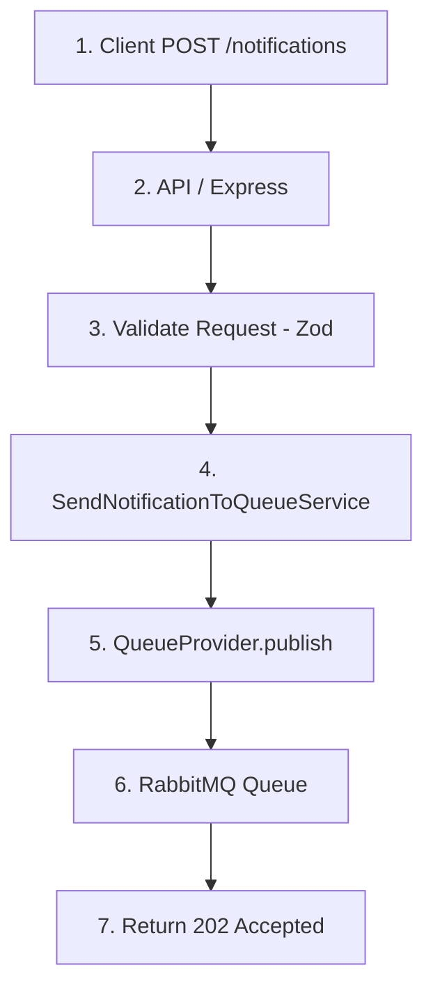
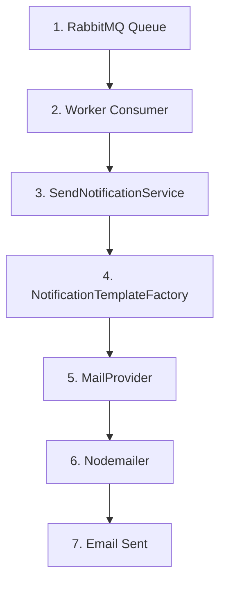

# 📬 Message Queue Notifications

<p align="center">
  
  
  
  
  
  
</p>

<p align="center">
  Sistema de notificações assíncronas utilizando RabbitMQ, Workers e arquitetura desacoplada 🚀
</p>

---

## 📖 Sobre

Este projeto implementa um sistema de notificações assíncronas baseado em filas de mensagens.

A aplicação simula fluxos reais utilizados em sistemas distribuídos modernos, onde uma API publica eventos em uma fila e workers especializados processam essas mensagens de forma desacoplada.

Exemplos:

- Cadastro de usuário
- Confirmação de pedido
- Confirmação de pagamento
- Envio de e-mails

---

## ⚙️ Requisitos

### Funcionais

1. Receber eventos através de uma API REST
2. Publicar eventos em uma fila RabbitMQ
3. Consumir mensagens através de workers
4. Processar notificações assíncronas
5. Enviar e-mails baseados no tipo de evento

### Não Funcionais

1. Baixo acoplamento entre serviços
2. Processamento assíncrono
3. Arquitetura escalável
4. Facilidade de manutenção
5. Facilidade de testes
6. Garantia de persistência das mensagens

---

## 🧠 Arquitetura

```txt
Client → API → RabbitMQ → Worker → Mail Provider
```

### API

Responsável por:

- receber requisições HTTP
- validar dados
- publicar mensagens na fila

### RabbitMQ

Responsável por:

- armazenar mensagens
- distribuir mensagens
- garantir persistência
- desacoplar processamento

### Worker

Responsável por:

- consumir mensagens
- processar notificações
- enviar e-mails

---

## 📁 Estrutura do projeto

```txt
src/
  notifications/
    controllers/
    dtos/
    factories/
    routes/
    services/

  providers/
    MailProvider/
      dto/
      fakes/
      implementations/
      models/

    QueueProvider/
      fakes/
      implementations/
      models/

  shared/
    bootstrap/
    constants/
    container/
    errors/
    http/

  server.ts
  worker.ts
```

---

## 🧩 API & Fluxo de Requisições

### 📬 POST /notifications

Publica uma notificação na fila para processamento assíncrono.

### Request Body

```json
{
  "type": "USER_CREATED",
  "email": "test@email.com"
}
```

### Response

```http
202 Accepted
```

```json
{
  "message": "Notification accepted for processing"
}
```



---

## ⚙️ Worker & Processamento



---

## 📨 Tipos de notificação

| Tipo | Descrição |
|---|---|
| USER_CREATED | Usuário criado |
| ORDER_CONFIRMED | Pedido confirmado |
| PAYMENT_CONFIRMED | Pagamento confirmado |

---

## 🧠 Decisões de Arquitetura

### RabbitMQ

- Garantia de entrega
- Persistência de mensagens
- Processamento assíncrono
- Escalabilidade horizontal
- Desacoplamento entre serviços

### Providers

A aplicação utiliza providers desacoplados através de interfaces.

Exemplos:

- RabbitMQProvider
- NodemailerProvider
- FakeMailProvider
- FakeQueueProvider

Isso permite:

- baixo acoplamento
- facilidade de testes
- troca de implementação
- extensibilidade

### Factory Pattern

Os templates de notificação são centralizados através de factories.

Isso evita:

- regras dentro dos providers
- duplicação de lógica
- alto acoplamento

### Worker Pattern

O processamento ocorre em background através de workers independentes.

Isso permite:

- maior performance da API
- processamento assíncrono
- escalabilidade independente

---

## 🛡 Error Handling

O projeto possui:

- AppError customizado
- middleware global de erros
- validação utilizando Zod
- tratamento centralizado

---

## 🧪 Testes

O projeto utiliza Vitest para testes unitários.

### Cobertura

- Services
- Factories
- Providers fakes
- Fluxos assíncronos

---

## ▶️ Como rodar

### Pré-requisitos

- Node.js 20+
- Docker
- Docker Compose

---

### Instalação

```bash
npm install
```

---

### Variáveis de ambiente

Crie um arquivo `.env`:

```env
EMAIL_USER=your_email@mail.com
EMAIL_PASS=your_app_password
```

---

## 🐳 Infraestrutura

### Subir RabbitMQ

```bash
npm run infra:up
```

---

### Derrubar infraestrutura

```bash
npm run infra:down
```

---

## 🚀 Desenvolvimento

### Rodar aplicação completa

```bash
npm run dev:full
```

Esse comando:

- sobe RabbitMQ
- sobe API
- sobe Worker

---

### Rodar apenas aplicação

```bash
npm run dev
```

---

## 🧪 Testes

### Rodar testes

```bash
npm run test
```

---

### Rodar coverage

```bash
npm run test:coverage
```

---

## 🧱 Conceitos aplicados

- SOLID
- Dependency Injection
- Provider Pattern
- Factory Pattern
- Worker Pattern
- Asynchronous Processing
- Queue Based Architecture
- Error Handling
- Unit Testing

---

## 🔥 Melhorias futuras

- Dead Letter Queue (DLQ)
- Retry com delay
- Logs estruturados
- Observabilidade
- Templates HTML
- AWS SES / SendGrid
- Dockerização completa
- CI/CD
- Metrics & Monitoring

---

## 👨‍💻 Autor

Desenvolvido por Lucas Fernandes.
